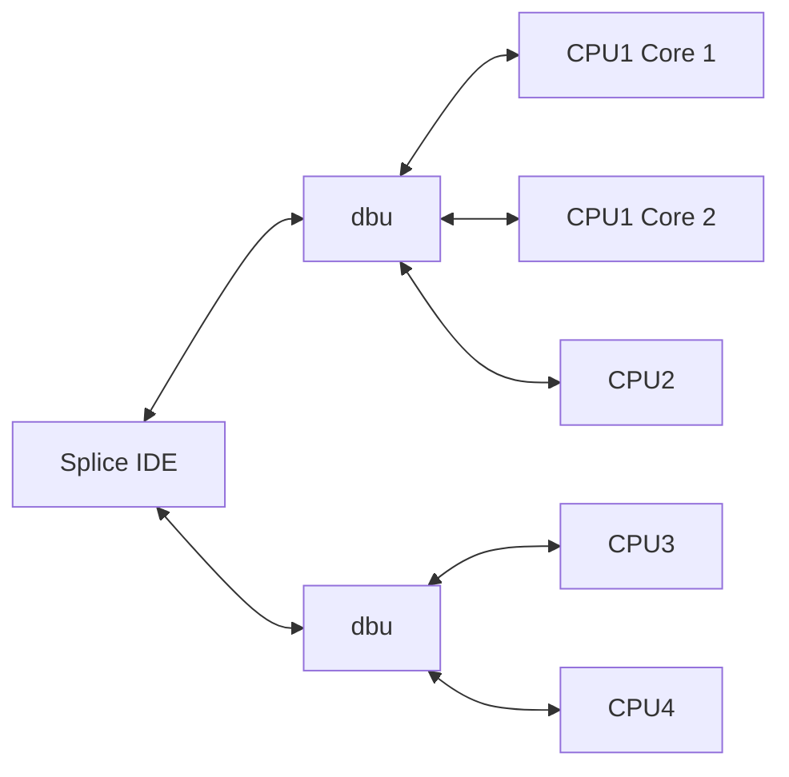

## Splice Integrating Development Environment

Splice IDE is being developed to realise the full multi target capabilities of the [dbu](https://github.com/brucebiotech/dbu) debug adapter.

Splice provides a multi-device programming and debug environment where binaries are built with existing cmdline build tools such as west and platform-io.

Splice directly connects to all target devices in a set avoiding the overhead of gdb-servers with individual connections to single-device debug adatpers.

This is achieved by incorporating functionality normally provided by gdb and gdb-servers such as openOCD.  To do this Splice loads Dwarf debug info for each target and implements its own multi-cmsis-dap protocol client.

This delivers improved performance and provides a seamless debug experience across all devices in a project.

 ## Conventional IDE's

Conventional IDE's must use gdb and gdb-servers (e.g. openOCD) to connect to each CPU.

