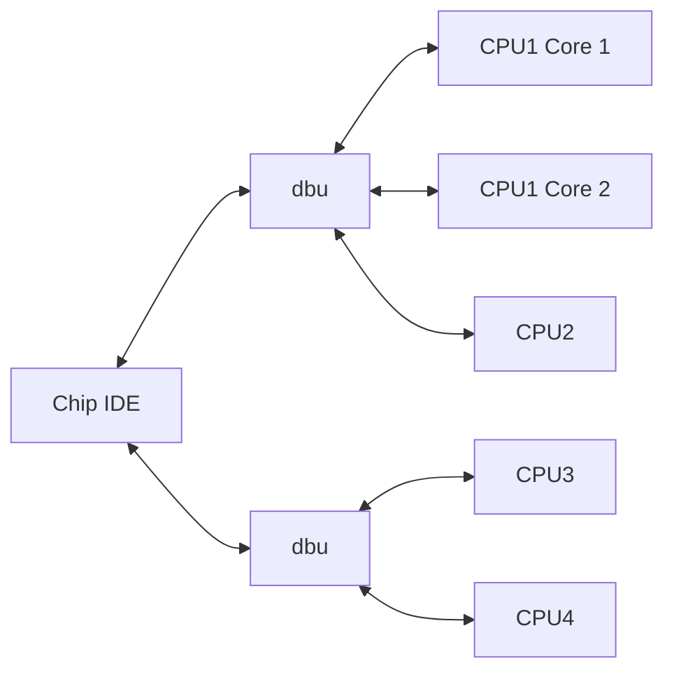

## Chip Integrated Development Environment

Chip IDE is being developed to realise the full multi target capabilities of the [dbu](https://github.com/brucebiotech/dbu) debug adapter.
Chip loads Dwarf debug info for each target to provide debug functionality normally provided by gdb.
Hence Chip connectects directly to multiple dbu's and multiple CPU's without the overhead of running gdb tools in separate processes.

 ## Conventional IDE's

Conventional IDE's must use gdb and gdb-servers (e.g. openOCD) to connect to each CPU.

